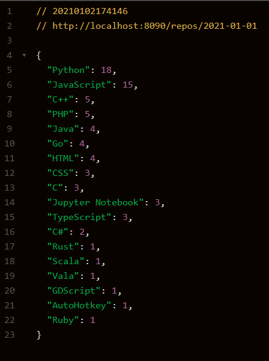

# My code for the gemography_backend_coding_challenge :blush:
REST microservice that list the languages used by the 100 trending public repos on GitHub.

# Functional specs

Develop a REST microservice that list the languages used by the 100 trending public repos on GitHub.
For every language, you need to calculate the attributes below 👇:

* Number of repos using this language

* The list of repos using the language

# How to get Trending Repos from Github :wink:

Fetching trending repositories simply translates to fetching the most starred repos created in the last 30 days ( from now ). To do that, you'll need to call the following endpoint:

https://api.github.com/search/repositories?q=created:>{date}&sort=stars&order=desc&per_page=100
The JSON data from Github will be paginated (you'll receive around 100 repos per JSON page). You can ignore the subsequent pages since you only need the first 100 repositories.

# Snippet of the request result :computer:
   
